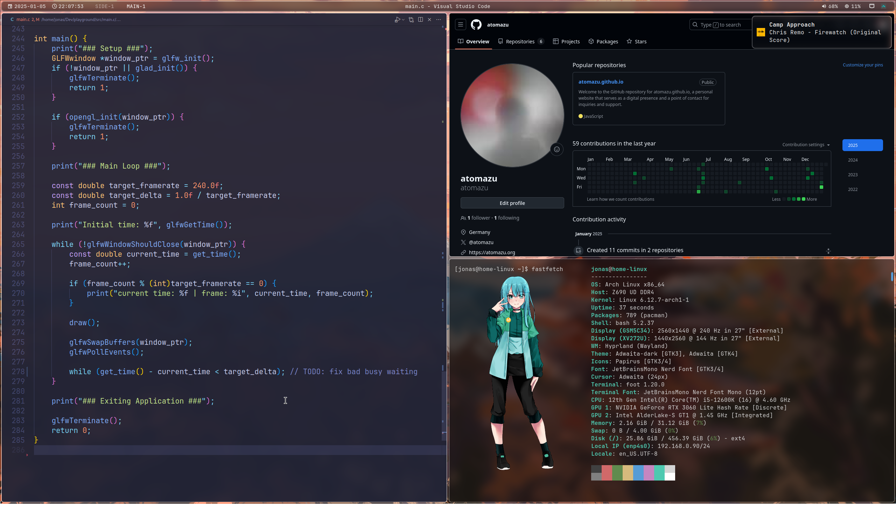
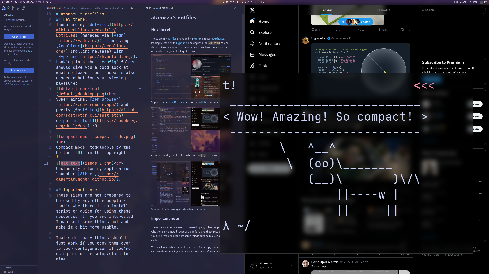
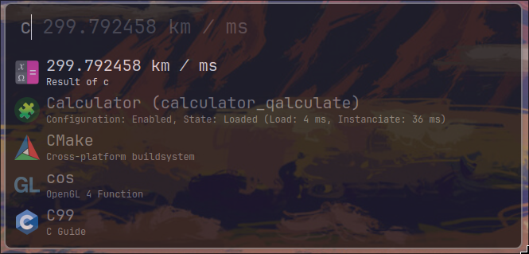

# atomazu's dotfiles
## Hey there!
These are my [dotfiles](https://wiki.archlinux.org/title/Dotfiles) (managed via [yadm](https://yadm.io/)), I'm using [Archlinux](https://archlinux.org/) (rolling release) with [Hyprland](https://hyprland.org/).
Looking into the `.config` folder should give you a good look at what software I use, here is also a screenshot for your viewing pleasure:
 
Super minimal [Zen Browser](https://zen-browser.app/) and pretty [fastfetch](https://github.com/fastfetch-cli/fastfetch) output in [foot](https://codeberg.org/dnkl/foot) :D

  
Compact mode, toggleable by the button `[D]` in the top right!

 
Custom style for my application launcher [Albert](https://albertlauncher.github.io/).

## Important note
These files are not prepared to be used by any other people - that's why there is no install script or guide for using these resources. If you are interested I can sort some things out and make it a bit more usable.

That said, many things should just work if you copy them over to your configuration if you're using a similar setup/stack to mine.